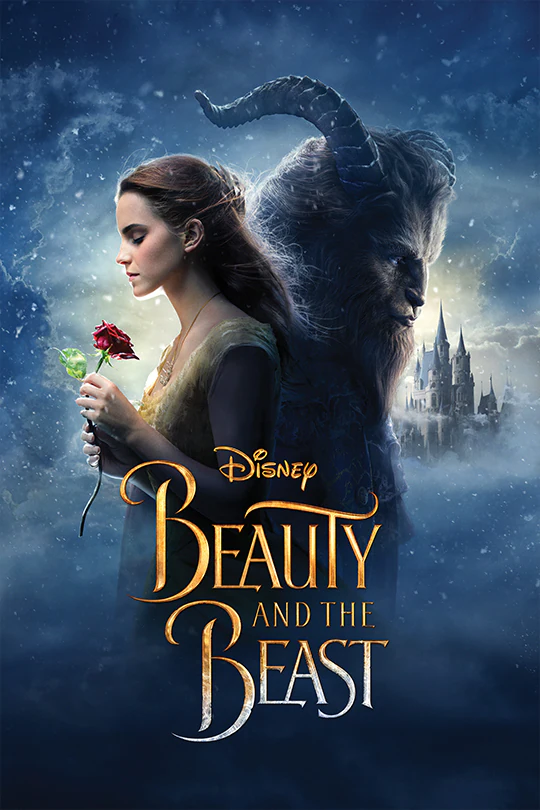
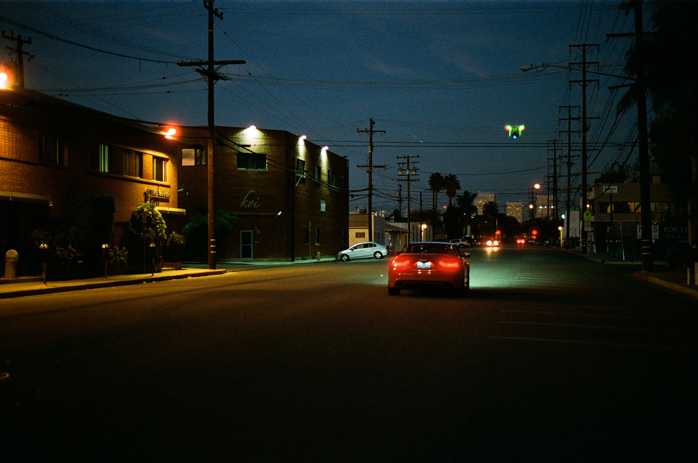

# Image Processing API
This Project is  for Udacity's
**Advanced Full-Stack Web Development Nanodegree Program**

## Scripts
___
     npm run start
Starts the server on the default port **3000** . [API URL(http://localhost:3000)
    
    npm run test
Transpile the app into javascript and the runs all tests.
    
    npm run build
 builds the app by transpiling     **Typescript** into **Javascript**.
    
    npm run jasmine    
 Runs all jasmine tests.
    
    npm run lint     
Runs linting rules.
    
    npm run prettier
Runs prettier rules
___
## API Segments
[/](http://localhost:3000/)
    returns Json

[/api](http://localhost:3000/api/)
    returns Json

[/api/images](http://localhost:3000/api/images/)
    returns Json

[/api/images/resize](http://localhost:3000/api/images/resize?filename=beautyandthebeast&width=200&height=500)
    returns resized image with requested parameters 
    this api route requires 
   - filename
   - width
   - height
   - target [optional] 
  
[/api/images/rotate](http://localhost:3000/api/images/rotate?filename=beautyandthebeast&angle=45)
    returns resized image with requested parameters 
    this api route requires 
   - filename
   - angle
   - target [optional] 
  
____
## Available Images

- beatyandthebeast

- encenadaport

- fjord

- icelandwaterfall

- palmtunnel

- santamonica

____